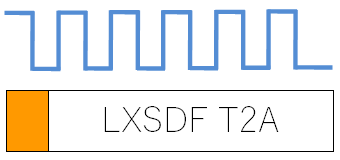
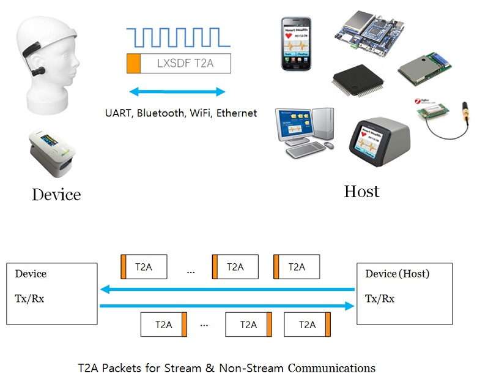
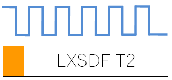
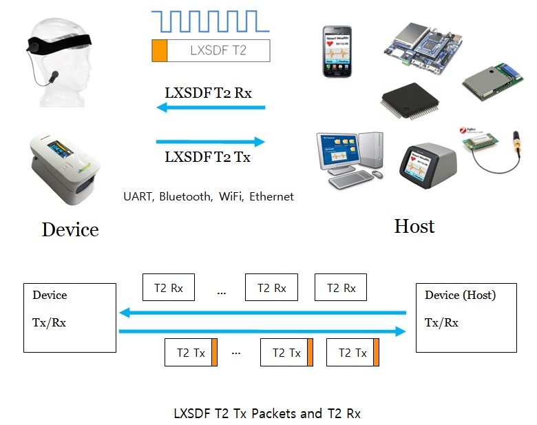

# LXSDF (LX Serial Data Format) Communication Standard.
LXSDF is a general purpose serial communication standard which is able to transmit real-time multi channel stream data and non-stream data. A typical example of multi channel stream is the time series data converted by the multi channel ADC(Analog to Digital Converter). LXSDF packet is so simple and small packet size. LXSDF can be used in any system using uart, wifi, bluetooth and ethernet  etc.

UART(com port, serial port) is the most commonly used serial communication. UART can transmit one byte sequentially, but it rarely happens that sends only one byte of data element needed in Communication in real applied process. For example, when transmitting 12 bit AD converted data, must transmit serial communication 2 bytes dividing 4 bits and 8 bits and unify them into one 12bits data in receiver. If there are various kinds of data to transmit, it is in need of packet concept. LXSDF can handle several bytes as one packet, transmitting and receiving sides use the data by separating according to the standard LXSDF.

# LXSDF T2A

## LXSDF T2A Documentation : http://laxtha.net/lxsdf-t2a

# LXSDF T2

## LXSDF T2 Documentation : http://laxtha.net/lxsdf-t2